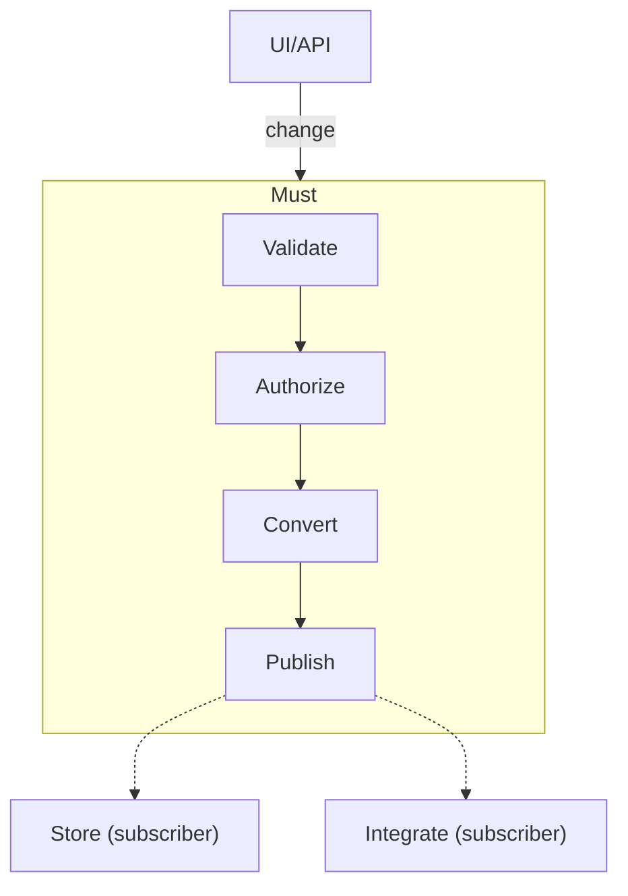

# Must

<!-- start-doc -->

A simplified set of tools for Event Sourcing.

While there are many technical and business benefits to Event Sourcing, proper implementation tends to require understanding of many new concepts and technical details. This package aims to make implementation easier and more enjoyable by providing a small extensible API with few dependencies baked in.

## Installation

If [available in Hex](https://hex.pm/docs/publish), the package can be installed
by adding `must` to your list of dependencies in `mix.exs`:

```elixir
def deps do
  [
    {:must, "~> 0.1.0"}
  ]
end
```

## Interface

- `Must.process_change!/2`: a unified function for processing a change.
- `Must.Change`: an extensible protocol for **processing changes**.
- `Must.EventBus`: a GenStage producer for **broadcasting events to subscribers**.
- `Must.EventStorage`: a behaviour for **storing events**.

### Fallback Implementations

When prototyping a system or testing `Must`'s fitness, it may be unnecessary to implement `Must.Change` for every change type. The protocol has `@fallback_to_any true`, so a single fallback implementation covers all changes.

For example, authorization may be bypassed by defining a fallback implementation that returns the change as-is:

```elixir
defimpl Must.Change, for: Any do
  def be_authorized!(change, _opts), do: change
end
```

⚠️ **WARNING**: Shipping production code with `Any` fallback implementations is not recommended. This is a useful option during development, but it can mask bugs and security issues when deployed.

## Example

Many systems have a process for activating a user. Here is an example of how to implement it using `Must`.

Define a change struct with validation, authorization, and event production:

```elixir
defmodule Acme.Identity.ActivateUser do
  @moduledoc "Change for activating a user."
  use Ecto.Schema

  @primary_key false
  embedded_schema do
    field :user_id, :integer
  end

  def changeset(%__MODULE__{} = change, params) do
    fields = __MODULE__.__schema__(:fields)

    change
    |> Ecto.Changeset.cast(params, fields)
    |> Ecto.Changeset.validate_required(fields)
  end

  defimpl Must.Change do
    def be_authorized!(change, opts) do
      actor = Keyword.fetch!(opts, :actor)

      if actor.user_id == change.user_id or
         actor.organization.status != :active or
         actor.organization.role not in [:admin, :manager] do
        raise Must.NotAuthorizedError, message: "not authorized"
      end

      change
    end

    def be_valid!(change, opts) do
      params = Keyword.fetch!(opts, :params)

      change
      |> changeset(params)
      |> Ecto.Changeset.apply_action!(:validate)
    end

    def be_events!(change, _opts) do
      [%UserActivated{user_id: change.user_id}]
    end
  end
end
```

Define an event as a plain struct — no protocol needed:

```elixir
defmodule Acme.Identity.UserActivated do
  defstruct [:user_id]
end
```

Process the change:

```elixir
%ActivateUser{}
|> Must.process_change!(
  params: %{"user_id" => 123},
  metadata: %{"actor" => current_user}
)
```

If the change is processed successfully, a list of events will be returned:

```elixir
[
  %UserActivated{
    user_id: 123
  }
]
```

The example above demonstrates:

- How to define a change struct and changeset
- How to implement the `Must.Change` protocol
- How to define an event struct (no protocol required)
- How to process a change using `Must.process_change!/2`
- Events are plain structs — persistence and side effects are handled by EventBus subscribers

### Colocation

While the `Must.Change` protocol is implemented directly in the `ActivateUser` example. Having the change and its rules in one place may aid developers and LLMs to understand the behavior while minimizing context switching.

However, this is not a requirement. It is also possible to define implementations elsewhere. Some teams may prefer to consolidate implementations into a separate module/file, for example.

## Architecture

`Must` is designed to be understood at a high level by engineers and interested non-technical stakeholders.
For product owners and subject matter experts engaged in a project, the following graph illustrates the patterns that will be followed during implementation.



| Term      | Description                                         | Examples                                          |
| --------- | --------------------------------------------------- | ------------------------------------------------- |
| UI/API    | User interface / external requests                  | Web page, HTTP API, WebSocket API                 |
| Validate  | Confirm data is acceptable                          | User activation includes an existing user ID      |
| Authorize | Confirm user is permitted to make the change        | An organization admin activates a user            |
| Convert   | Transform change into event(s)                      | ActivateUser -> UserActivated                     |
| Publish   | Emit events to the EventBus for subscribers         | GenStage producer fan-out                         |
| Store     | Persist events (subscriber concern)                 | SQLite, PostgreSQL, Kafka                         |
| Integrate | Side effects and projections (subscriber concern)   | Emails, materialized views, webhooks              |

🤔 Note that common Event Sourcing terms like aggregate, projection, and process manager are absent from `Must`'s core. The pipeline handles validation, authorization, and event production; everything else is a subscriber.

## Design Decisions

To support a wide variety of use cases, the `Must.Change` protocol may be implemented for structs. For most systems, it is recommended to define changes as Ecto embedded schemas to provide clear intent to developers and coding tools. This approach also allows validation, authorization, and event production to be colocated with the change definition. Readers can view a single file to understand the change definition and its behavior.

Events are plain structs with no required protocol. They flow through the EventBus to subscribers for persistence and side effects. This keeps the change pipeline synchronous and predictable while allowing asynchronous, fault-tolerant event processing via subscriber pipelines (GenStage, Broadway, etc.).

For best results, return change & event structs if all conditions are met, or raise an error if any conditions are not met.

## Event Persistence

Several adapters are **planned** to support different persistence strategies:

- [ ] [Ecto SQL](https://hex.pm/packages/ecto_sql)
- [ ] [Ecto SQLite3](https://hex.pm/packages/ecto_sqlite3)
- [ ] [ClickHouse](https://hex.pm/packages/ecto_ch)
- [ ] [TigerBeetle](https://hex.pm/packages/tigerbeetlex)
- [ ] [DurableServer](https://hex.pm/packages/durable_server)
- [ ] [ETS](https://www.erlang.org/doc/apps/stdlib/ets.html)
- [ ] [AVRO file](https://avro.apache.org/docs/current/)

Each adapter will need to:

- Initialize a standardized data structure (see [cloudevents spec](https://github.com/cloudevents/spec))
- Persist events to a storage backend
- Handle event persistence errors
- Provide a way to query events from the storage backend
- Track the last seen event version
- Handle event version conflicts
- Support testing

## Event Delivery

Events are delivered via `Must.EventBus`, a GenStage producer that broadcasts events to all subscribers with backpressure.

- [x] [GenStage](https://hex.pm/packages/gen_stage)

Additional delivery mechanisms are **planned** for environments where GenStage is not appropriate:

- [ ] [Phoenix PubSub](https://hex.pm/packages/phoenix_pubsub)
- [ ] [Kafka](https://kafka.apache.org/)
- [ ] [RabbitMQ](https://www.rabbitmq.com/)
- [ ] [WebSockets](https://developer.mozilla.org/en-US/docs/Web/API/WebSocket)
- [ ] [Server-Sent Events (SSE)](https://developer.mozilla.org/en-US/docs/Web/API/Server-sent_events)

## What Abouts

Experienced Event Sourcing developers may be wondering where several typical components and concerns are defined in this package.

- Projections
- Process Managers
- Value Objects
- Contexts
- Aggregates
- Dynamic consistency boundaries
- Snapshots

`Must` aims to empower engineers to be productive quickly, with or without prior Event Sourcing experience. The value of Event Sourcing is in its state management and reactivity properties, not in its jargon. With a simpler approach, the hope is that Event Sourcing will be accessible to a wider audience. Technicians and leaders who are apprehensive about adopting Event Sourcing may find `Must` to be a more approachable alternative to implementations which strictly adhere to the concepts and terminology of Event Sourcing.

While the interface is simple, all of the traditional Event Sourcing concepts may be supported through `Must`'s extensible design.
